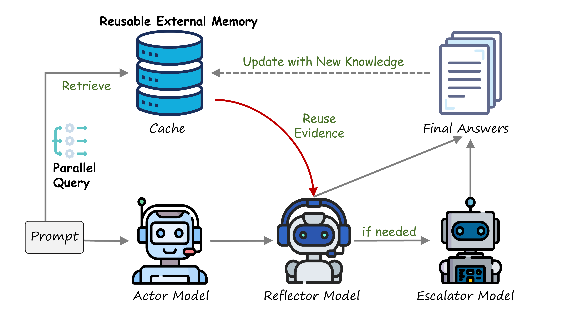

# CacheXL: Cross-Instance Learning via Online Cache for Efficient and Enhanced LLM Inference

<p align="center">
  
</p>

## Authors

**Ruiqing Yue**<sup>1,2</sup>, **Yu Cui**<sup>3</sup>, **Xianhong Xue**<sup>1,2</sup>, **Sicheng Pan**<sup>3</sup>, **Zhuoyu Sun**<sup>3</sup>, **Yifei Liu**<sup>3</sup>, **Baohan Huang**<sup>3</sup>, **Zhe Cui**<sup>1,2</sup>, **Haibin Zhang**<sup>4,5</sup>, **Cong Zuo**<sup>3</sup>

<sup>1</sup>Chengdu Institute of Computer Applications, Chinese Academy of Sciences
<sup>2</sup>University of Chinese Academy of Sciences
<sup>3</sup>Beijing Institute of Technology
<sup>4</sup>Yangtze Delta Region Institute of Tsinghua University, Zhejiang
<sup>5</sup>Jiaxing Key Laboratory of Artificial Intelligence and Cyber Resilience

📧 Contact: [yueruiqing25@mails.ucas.ac.cn](mailto:yueruiqing25@mails.ucas.ac.cn), [cuiyu@bit.edu.cn](mailto:cuiyu@bit.edu.cn)

## Abstract

Cross-instance learning is an emerging mechanism for improving LLM reasoning. It applies batch reflection to share information across queries and improve reasoning performance. However, instances aggregated within the same batch often lack semantic relevance to the current query, limiting the specificity of reflective feedback. We propose **CacheXL**, a cache-augmented cross-instance learning framework that maintains an online evidence cache of high-confidence historical reasoning instances and retrieves semantically similar examples as targeted reflective evidence. In CacheXL, the online evidence cache serves as the central mechanism for cross-instance learning. The full system integrates retrieval-based evidence reuse, selective reflection, and escalation, and runs retrieval asynchronously with initial reasoning to reduce additional latency. Extensive experiments on nine reasoning benchmarks and five LLMs show that CacheXL improves average accuracy and calibration across models. It also achieves lower end-to-end latency than batch reflection.

## Method

### Key Components

| Component | Role |
|-----------|------|
| **Actor** | Generate initial rationale, answer, and confidence |
| **Reflector** | Evaluate with retrieved context, decide acceptance |
| **Escalator** | Re-solve difficult cases (when both confidences < τ_l) |
| **Evidence Cache** | Store high-confidence instances for retrieval |

### Key Design

- **Evidence Cache**: Maintains high-confidence historical instances with queries, rationales, answers, and feedback
- **Asynchronous Retrieval**: Runs cache retrieval in parallel with initial Actor reasoning
- **Selective Escalation**: Triggers Escalator only when both confidence scores < τ_l
- **Cache Admission**: Strict policy requiring acceptance, reusability, and both confidences ≥ τ_h

## Results

CacheXL achieves the highest average accuracy across five LLMs and nine benchmarks, outperforming both ReAct and [Batch of Thought (BoT)](https://arxiv.org/abs/2601.02950) (ACL 2026 Oral):

| Model | ReAct | BoT | CacheXL |
|-------|-------|-----|---------|
| Qwen3-80B | 64.80 | 76.14 | **80.30** |
| Qwen2.5-7B | 56.27 | 59.61 | **65.14** |
| Llama-3.3-70B | 67.38 | 69.95 | **76.86** |
| DeepSeek-V3 | 69.51 | 71.46 | **75.26** |
| Qwen2.5-32B | 62.08 | 62.68 | **68.02** |

CacheXL also achieves lower ECE (better calibration) and lower latency than BoT across all models.

## Quick Start

### Prerequisites

- Python >= 3.11
- API access to LLM services (e.g., NVIDIA API)

### Installation

```bash
# Clone the repository
git clone https://github.com/yuranqiu/CacheXL.git
cd CacheXL

# Initialize environment and install dependencies
bash scripts/setup_env.sh
```

### Configuration

```bash
# Copy example configuration
cp .env.example .env

# Edit .env file with your API key and settings
```

### Data Preparation

```bash
# Download datasets
python scripts/prepare_data.py --dataset gpqa,mmlu,math500
```

### Run Experiments

```bash
# Run CacheXL method
python src/run_cachexl.py --dataset gpqa,mmlu

# Run ReAct baseline
python src/run_react.py --dataset gpqa,mmlu

# Run BoT method
python src/run_bot.py --dataset gpqa,mmlu

# Run all methods in parallel
python scripts/run_experiments.py
```

## Project Structure

```
CacheXL/
├── src/
│   ├── run_react.py          # ReAct baseline entry
│   ├── run_bot.py            # BoT method entry
│   ├── run_cachexl.py        # CacheXL method entry
│   ├── core/
│   │   ├── config.py         # Configuration
│   │   ├── llm.py            # LLM client
│   │   └── utils.py          # Utilities
│   └── methods/
│       ├── react/            # ReAct baseline
│       ├── bot/              # BoT method
│       └── cachexl/          # CacheXL method
│           ├── workflow.py   # Main workflow
│           ├── cache.py      # Evidence cache
│           └── prompts.py    # Prompt templates
├── scripts/
│   ├── run_experiments.py    # Run all experiments
│   ├── stop_experiments.py   # Stop running experiments
│   ├── generate_report.py    # Generate comparison report
│   ├── compare_methods.py    # Compare method results
│   └── prepare_data.py       # Download datasets
├── data/                     # Datasets
├── figures/                  # Figures
├── .env.example              # Configuration template
└── pyproject.toml            # Project dependencies
```

## License

This project is licensed under the MIT License - see the [LICENSE](LICENSE) file for details.
